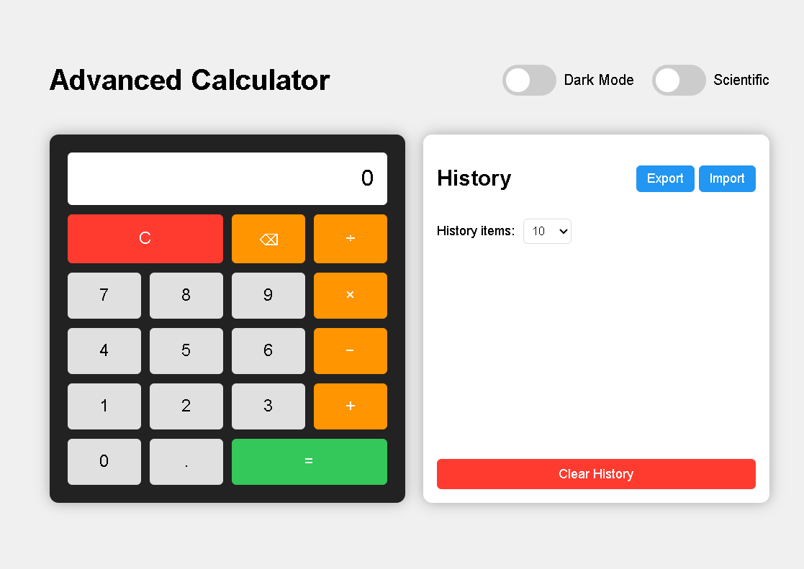

# 🧮 JavaScript Calculator

[](https://github.com/eswarsamanthula/js-calculator/stargazers)
[](https://github.com/eswarsamanthula/js-calculator/network/members)
[](https://github.com/eswarsamanthula/js-calculator/issues)
[](https://github.com/eswarsamanthula/js-calculator/blob/main/LICENSE)

A simple, responsive, and interactive calculator built with **HTML**, **CSS**, and **JavaScript**. Perform basic arithmetic operations like addition, subtraction, multiplication, and division in an easy-to-use interface.

🔗 **Live Demo:** [eswarsamanthula.github.io/js-calculator](https://eswarsamanthula.github.io/js-calculator)

---

## ✨ Features

- ➕ Addition, ➖ Subtraction, ✖️ Multiplication, ➗ Division
- 🔄 Clear the display with a button
- 🖩 Responsive design for mobile and desktop
- 💾 Memory storage for previous results *(optional, if implemented)*

---

## 📸 Screenshots

### 📌 Home Screen



> 📁 Remember to place your screenshots in a `screenshots/` folder for this to work.

---

## 📅 Roadmap

- [x] Basic Arithmetic Functions (Add, Subtract, Multiply, Divide)
- [x] Clear Button
- [x] Decimal support
- [x] Keyboard Input Support
- [x] Dark Mode Theme 🌙
- [x] Advanced functions (Square Root, Power, etc.)
- [ ] Unit Conversion (Length, Weight, etc.)

---

## 🛠️ Tech Stack

- HTML5
- CSS3
- JavaScript (Vanilla)
- GitHub Pages (for hosting)

---

## 📂 Project Structure

📦 js-calculator ┣ 📜 index.html ┣ 📜 style.css ┣ 📜 script.js ┣ 📁 screenshots/ ┃ ┣ 📸 calculator.png ┗ 📜 README.md

### Clone the repository

```bash
git clone https://github.com/eswarsamanthula/js-calculator.git
cd js-calculator
```
## Run locally
Open index.html in your browser to see the calculator in action — no setup required!

## 🙌 Contributing
Feel free to open issues or create pull requests if you have suggestions, fixes, or improvements.

## 📬 Contact
Created by Eswar Samanthula
📧 Email: eswarsamanthulas@gmail.com
